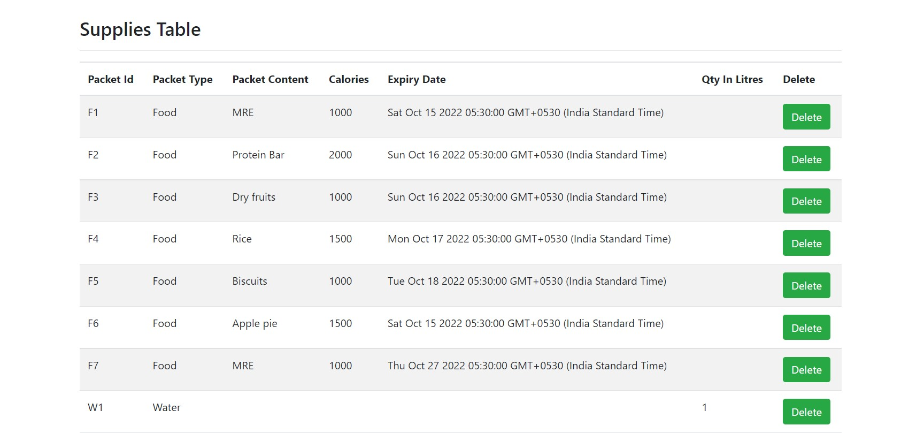

# Martian Survival Task

## Table of contents
- [Problem](#problem)
- [Run](#run)
- [Technology](#technology)
- [Demo](#demo)

### Problem
 A ration system for a person stuck at mars and has to eat 2500 calories a day and has to consume 2 L of water per day

### Run
To run this application, you may have to set your own environmental variables for the PORT  
Install node modules using  `npm install`  
Now you can run `npm start` in the terminal and the application should work.

### Technology
The application is built with:
- Node.js 
- MongoDB
- Express 
- Bootstrap 
- EJS
- CSS

## Demo
#### Supplies Table

#### Scheduled Table

